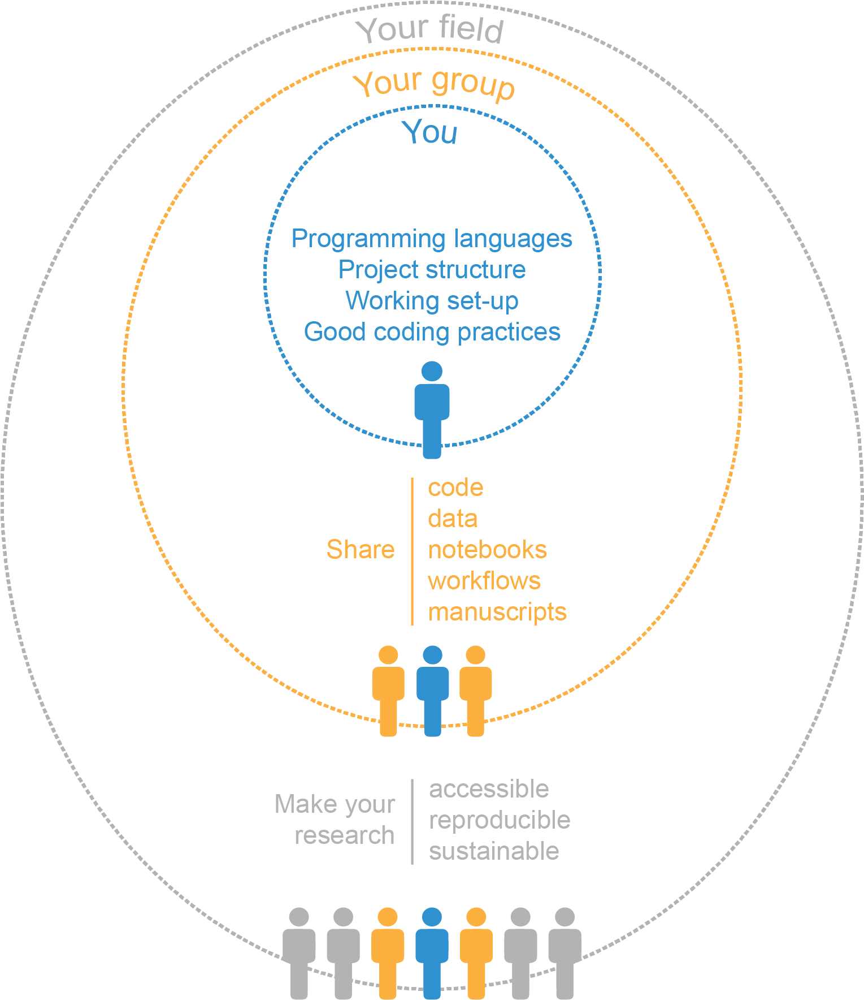

## Introduction

Since Margaret Dayhoff pioneered the field of bioinformatics in the sixties, the application of computational tools in the field of biology has vastly grown in scope and impact. At present, biotechnological and biomedical research are routinely fed by the insights arising from novel computational approaches, machine learning algorithms, and mathematical models. The ever-increasing amount of biological data and the exponential growth in computing power will amplify this trend in the years to come.

The use of computing to address biological questions encompasses a wide array of applications usually grouped under the terms "computational biology" and "bioinformatics." Although distinct definitions have been delineated for each one [@https://www.kennedykrieger.org/sites/default/files/library/documents/research/center-labs-cores/bioinformatics/bioinformatics-def.pdf;@pmid:11552348], here we will consider both under the umbrella term “computational biology,” alluding to any application that involves the intersection of computing and biological data. As such, a computational biologist can be a data analyst, a data engineer, a statistician, a mathematical modeler, a software developer, and many other roles. In praxis, the modern computational biologist will be a “scientist of many hats,” taking on several of the duties listed above. But first and foremost, we will consider a computational biologist as a scientist whose ultimate goal is to answer a biological question or address a need in the life sciences by means of computation.

Scientific computing requires following specific principles to enable shareable, reproducible, and sustainable outputs. Computing-heavy disciplines, such as software engineering and business analytics, have adopted protocols addressing the need for collaboration, visualization, project management, and strengthening of online communities. However, as a highly interdisciplinary and evolving field, computational biology has yet to acquire a set of universal "best practices." Since most computational biologists come from diverse backgrounds and rely on self-study rather than formal education [@doi:10.1109/SANER.2018.8330263], the absence of guidelines may lead many computational biologists astray, using methods that hinder reproducibility and collaboration, such as unreproducible computational workflows or closed-source software, retarding biomedical and biotechnological research.

In recent years, this "guidelines gap" has been addressed by the establishment of FAIR principles—Findability, Accessibility, Interoperability, and Reusability—in 2016 [@doi:10.1038/sdata.2016.18]. Originally developed for data stewardship, FAIR principles have been proposed as universal guidelines for all research-related outputs [@doi:10.1016/j.patter.2021.100206]. However, translating these high-level principles into day-to-day practices requires additional nuances based on the type of research, the size and scope of the project, and the researcher's experience. To address the need for FAIR scientific software, for example, the framework ADVerTS (availability of software, documenting software, version control, testing, and support) has been proposed as a set of "barely sufficient" practices [@doi:10.1016/j.patter.2021.100206]. More broadly, reviews exist covering general topics for bench scientists new to computational biology—such as programming and project organization [@doi:10.1371/journal.pcbi.1005510;@doi:10.1371/journal.pbio.1001745;@doi:10.1093/gigascience/giz054;@doi:10.1038/nbt.2740;@doi:10.1371/journal.pcbi.1005871]—to detailed descriptions for the more seasoned data scientist—such as workflow automation [@doi:10.1101/2020.06.30.178673], software library development [@doi:10.1016/j.cels.2017.08.003], software version control with the cloud service GitHub [@doi:10.1371/journal.pcbi.1004947], and interactive data science notebooks with Jupyter [@arxiv:1810.08055v1].

Although the above reviews are immensely helpful, an overview of tools for better computational biology is missing. Indeed, guiding principles and general advice are key to establishing a behavior roadmap but their implementation is enabled by incorporating the right tools into our daily working routine. Tool selection has many components, such as availability, suitability, and personal preference; although the latter is left to the reader, here we will shed light on the first two. We premise that good practices in computational biology lie within a continuum that traverses three levels: personal (you), collaboration (your group), and community (your field) (Figure {@fig:levels-fig}). Each of these levels has a different set of requirements and challenges, as well as a specific set of tools that can be used to address them. Here, we compiled a curated list of these tools, emphasizing their time and place in a computational biology research project. Committed to practicality, we illustrated the utility of these tools in case studies covering a wide spectrum of research topics that computational biologists can use to model their own practices, modifying them to suit their own needs and preferences.

{#fig:levels-fig width="75%"}
