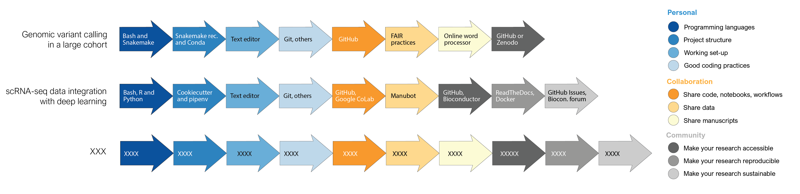

## Case Studies

We will now exemplify the use of all the introduced tools by presenting three different computational biology projects from the literature, detailing which tools are beneficial for those types of projects, depending on their scope and magnitude (Figure {@fig:cases-fig}) (two more cases are presented in [Supplementary Material](#supplementary-material)). Note that this is a non-comprehensive list, but it is rather intended as a short overview of how can projects in computational biology benefit from robust computational tools and good software development practices. Additionally, it will be quickly evident by reading these case studies that there is a lot of repetition in the chosen tools. For instance, all projects include an environment manager such as Conda, and a version control system like Git. This repetition is intentional, as it denotes that some tools, especially the ones at the personal research level, are ubiquitous in computational biology and can benefit any project in the field.

{#fig:cases-fig width="100%"}

### Case study 1: Genomic variant detection in a large cohort

Nowadays, the availability and affordability of NGS allows routine sequencing of dozens to even thousands of individuals. These resequencing experiments enable discovery and genotyping of genomic variation within large cohorts to answer key questions regarding population history and susceptibility to disease. For this example, let's consider a project including whole-genome Illumina sequencing and variant calling in thousands of individuals such as [@doi:10.1101/2021.07.12.452063]. In a project of this nature, the challenge resides on applying a multi-step variant calling pipeline on a big sample size in a reproducible manner.

In this particular project, the authors utilized the AnVil cloud computing platform, which uses WDL for workflow description. However, if you have access to an HPC, then a project of this nature can be done using the workflow automation tool Snakemake, using Python to parse sample names and perform other data handling operations, and following Snakemake's recommendation for folder structure. A Conda environment can hold all necessary software since Bioconda contains a wide array of software designed for genomics analyses. The actual coding of the workflow can be done in any text editor that offers easy integration with Git commands and Git hosting repository, such as Atom or Visual Studio Code. Although there are no formal styling rules for Snakefiles, embrace consisting variable and rule naming, and comment your code when needed.

A project of this magnitude will usually imply collaborators from other research groups. The pipelines and scripts can be shared using a GitHub repository. If privacy is a concern, the repository can be set as private and made public in later stages of the project. To write the manuscript, a general-purpose word processors such as Google Doc would suffice, especially if not all your collaborators are familiarized with Git and tools like Manubot. Considering that this type of data are a valuable resource for the community, follow FAIR principles for data sharing. Besides uploading the raw data in a repository like ENA or NCBI, we encourage you to openly share your code, analyses and other types of data in either a GitHub repository or a dedicated research repository like Zenodo.

### Case study 2: scRNA-seq data integration

Single-cell RNA-seq (scRNA-seq) is a rapidly evolving technology that has enable the study of cell heterogeneity and developmental changes of a cell lineage, otherwise intractable with bulk RNA-seq. Current scRNA-seq experiment deliver the transcriptomic profiles of thousand to a million of cells [@doi:10.1038/nprot.2017.149], making them a suitable target for machine or deep learning approaches. Among the many challenges imposed by this technology, a key one is the integration of scRNA-seq datasets, especially in case-control studies where cell types need to be functionally matched across dataset before evaluating differences across conditions. For this case study, we will consider the development of an unsupervised deep learning method for data integration as described in [@doi:10.1186/s13059-019-1766-4].

This kind of project often uses a combination of Python, R and Bash scripting depending on the task: Python can be used to write and train deep learning models with TensorFlow and PyTorch libraries, R enables straightforward data pre-processing with tools such as Seurat, and Bash can handle large scale processing of raw data files which cannot be loaded directly into RAM (often required by R and Python applications). Additionally, we advice to use the Python’s reticulate library to incorporate Python tools into the existing R ecosystem. To set up your working directory, we recommend a structure like Cookiecutter Data Science, which includes separated folders for trained models and other components of a deep learning project. To set up a software environment, Python virtual environments like pipenv and virtualenv work well with Tensorflow and PyTorch. The actual coding can be done in any general purpose text editor, such as Atom or Visual Studio Code, where updates can be easily push/pull to GitHub. As a good practice, keep the code modular and properly commented, and use detailed filenames with data stamps and model parameters to facilitate revisiting projects. Additionally, take advantage of tools such as TensorFlow's TensorBoard to diagnose, visualize, and experiment with your models.

When working with collaborators, the best way to share the code is through a Git hosting service like GitHub. When multiple-users need to edit the code in real-time, then Google CoLab is an excellent platform since it offers interactive coding and GPU access. In addition to the code repository, a Manubot can be crated to write the manuscript collaboratively. To make your tool accessible to a larger community, the code can be taken from an internal repository to a public GitHub, which must include an overview of the tool and a license file. Considering that most users in the field use R, you can go step further and share your code as Bioconductor package, making sure your method can be called directly in R and that interacts with standard data-structures in the field. For better reproducibility, document your method including example tutorials in a platform like ReadTheDocs or Gitbook, and share the software environment needed to deploy the models as a Docker container. GitHub issues and Bioconductor forums are suitable platforms to promptly reply to users questions, bugs reports, and enhancement opportunities.

### Case study 3: Tool development for constraint-based modeling

The last case study we will present is related to constraint-based modeling, a common approach used for simulating cellular metabolism. In this approach, the complete (or partial) metabolic network of a given organism is inferred from its genome and/or literature, and converted to a matrix that contains the reaction's stoichiometry, hence referred to as a stoichiometric matrix. Using a few simple assumptions, this matrix can then be used to perform simulations under different experimental conditions, to obtain additional insight into cellular physiology [@doi:10.1038/nrg3643]. Several tools have been developed for working with these type of models; here we will consider as example cobrapy [@doi:10.1186/1752-0509-7-74], a community tool for reading/writing constrained-based models and performing basic simulation operations.

A tool of this nature is especially useful if developed in Python, as it should ideally be presented as a package which can be easily installed with pip or similar. The use of an IDE is ideal for this case, as it will provide additional features for testing changes in the tool. Practices that for other case studies were useful now become pretty much essential, like complying with coding style and using version control. This is because there will potentially be hundreds of people that will read your code, so it needs to be easy to understand, and changes need to be clearly highlighted. Furthermore, the code should be (1) available via a hosting service such as GitHub, (2) tested with a continuous development tool such as GitHub Actions, (3) manually reviewed by collaborators to ensure correctness, (4) released following semantic versioning standards, and (5) documented with a companion documentation website, rich with tutorials and how-to guides. As a branching strategy, Gitflow is probably the best suited, as it allows to have all changes in a development branch, and stable releases in a master branch.

Finally, and due to the size of a project like this, additional considerations must be made for keeping a healthy user-base. The first one is to offer a place for users to raise their questions such as Gitter, Google groups or GitHub Discussions, and to make sure to reply to new questions often. Additionally, guidelines should be provided for everything: for how to open issues (ideally with issue templates), for how to contribute (ideally with pull request templates), for how to communicate within the community (with a code of conduct), and for any other routine task (with development guidelines and/or wikis). Addressing issues is also essential in a project of this nature, as if not done routinely they quickly pile up, and is an indicator that a project has gone stale. Additional tools such as a Kanban flowchart with the help of GitHub projects will help prioritize issues, and if several repos have to be jointly coordinated, tools like Jira or Znehub could be implemented instead.
