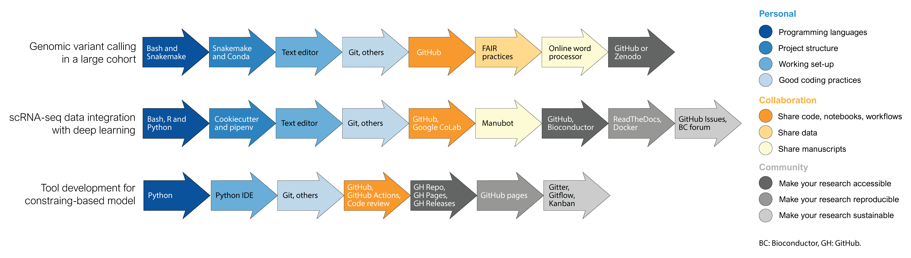

## Case Studies

We will now exemplify the effective use of the introduced tools by presenting three different computational biology projects from the literature (Figure {@fig:cases-fig}) (two more cases are presented in the [Supplementary Material](#supplementary-material)). Note that our list of projects is not meant to be comprehensive, but rather is intended to be a short overview of how projects in computational biology benefit from robust tools and software development practices. Additionally, it will be evident that there is considerable redundancy in chosen tools across case studies. For instance, all projects include an environment manager such as Conda, and a version control system like Git. This redundancy is intentional as it highlights the ubiquity of some tools.

{#fig:cases-fig width="100%"}

### Case study 1: Genomic variant detection in a large cohort

The availability and affordability of NGS allow for the routine assessment of dozens to thousands of genomes. Resequencing experiments enable the discovery and genotyping of genomic variation within large cohorts to answer key questions regarding population history and susceptibility to disease. For this example, let's consider a project including whole-genome Illumina sequencing and variant identification in thousands of individuals such as Aganezov et al. [@doi:10.1101/2021.07.12.452063]. Herein, the challenge resides in applying a multi-step variant-calling pipeline on many samples in a reproducible manner.

In this particular project, the authors utilized the AnVIL cloud computing platform [@https://anvilproject.org/;@doi:10.1016/j.xgen.2021.100085], which uses WDL for workflow description. However, if you have access to an HPC cluster, then a project of this nature can be performed using the workflow automation tool Snakemake [@https://snakemake.github.io/], employing Python to parse sample names and perform other data handling operations, and following Snakemake workflow template [@https://github.com/snakemake-workflows/snakemake-workflow-template] for folder structure. A Conda [@https://docs.conda.io/] environment can hold all necessary software since a wide array of software designed for genomic analyses is available via the Bioconda [@https://bioconda.github.io/] repository. Coding the workflow can be done in any text editor that offers easy integration with Git tracking and hosting, such as Visual Studio Code [@https://code.visualstudio.com/]. For code styling, you can run Snakefmt [@https://github.com/snakemake/snakefmt] to follow best practices.

A project of this magnitude usually requires collaborators from other research groups. The pipelines and scripts can be shared using a GitHub repository [@https://github.com]. If privacy is a concern, the repository can be set as private and made public in later stages of the project. To write the manuscript, general-purpose word processors such as Google Docs [@https://www.google.com/docs/about/] would suffice. Considering that these types of data are a valuable resource for the community, FAIR principles [@doi:10.1038/sdata.2016.18] for data sharing should be followed. In addition to uploading the raw data in a public repository like the European Nucleotide Archive (ENA) or the National Center for Biotechnology Information (NCBI), we encourage open sharing of your code and notebooks in a GitHub repository archived in Zenodo [@https://zenodo.org] with a DOI.

### Case study 2: Single-cell (sc)RNA-seq data integration

scRNA-seq is a rapidly evolving technology that has enabled the study of cell heterogeneity and developmental changes of a cell lineage, otherwise intractable with bulk RNA-seq. Current scRNA-seq experiments deliver the transcriptomic profiles of thousands to millions of cells [@doi:10.1038/nprot.2017.149], making them a suitable target for machine- or deep-learning approaches. Among the many challenges imposed by this technology, integration of scRNA-seq datasets is key, especially in case-control studies where cell types should be functionally matched across datasets before evaluating differences across conditions. For this case study, we will consider the development of an unsupervised deep-learning method for data integration as described in Johansen and Quon [@doi:10.1186/s13059-019-1766-4].

This kind of project often uses a combination of Python, R, and shell scripting. Python can be used to write and train deep-learning models with TensorFlow [@https://www.tensorflow.org/] or PyTorch [@https://pytorch.org/] libraries. R enables straightforward data pre-processing with tools such as Seurat [@https://satijalab.org/seurat/;@doi:10.1016/j.cell.2021.04.048]. Shell scripting can process large-scale raw data files in HPC clusters. Additionally, we advise using Python’s reticulate library [@https://rstudio.github.io/reticulate/] to incorporate Python tools into the existing R ecosystem. To set up your working directory, we recommend a structure like Cookiecutter Data Science [@https://drivendata.github.io/cookiecutter-data-science], which includes separate folders for trained models and other components of a deep-learning project. To establish a software environment, Python virtual environments, such as virtualenv [@https://virtualenv.pypa.io/], work well with Tensorflow and PyTorch. Coding can be performed in any general-purpose text editor, such as Visual Studio Code [@https://code.visualstudio.com/], where updates can be easily pushed/pulled to/from GitHub. As a good practice, maintain modular, properly-commented code and name files with data stamps and model parameters to facilitate revisiting projects. Additionally, take advantage of tools such as TensorBoard [@https://www.tensorflow.org/tensorboard] to diagnose, visualize, and experiment with your models.

When working with collaborators, code should be shared through a Git hosting service like GitHub. When multiple users need to edit the code in real-time, Google CoLab [@[https://colab.research.google.com](https://colab.research.google.com/)] offers interactive coding and GPU access. In addition to the code repository, a Manubot [@https://manubot.org/] can be created to write the manuscript collaboratively. To make your tool accessible to a larger community, publish it to a public GitHub and include a readme [@https://www.makeareadme.com] and an appropriate license file [@https://choosealicense.com/licenses]. Considering that most users in the field use R, you can go one step further and share your code as a Bioconductor package [@https://www.bioconductor.org/], making sure your method can be called directly in R and that interacts with standard data structures in the field. For better reproducibility, document your method including example tutorials in a platform like ReadTheDocs [@https://readthedocs.org], and share the software environment needed to deploy the models as a Docker image [@https://www.docker.com]. GitHub issues [@https://guides.github.com/features/issues] and Bioconductor forums [@https://support.bioconductor.org/] are suitable platforms to promptly reply to users’ questions, bug reports, and requests for code enhancements.

### Case study 3: Tool development for constraint-based modeling

The last case study we will present is related to constraint-based modeling, a common approach used for simulating cellular metabolism. In this approach, the metabolic network of a given organism is inferred from its genome and/or literature and converted to a matrix that contains the reaction's stoichiometry. Using a few simple assumptions, this matrix can be used to perform simulations under different experimental conditions to obtain additional insight into cellular physiology [@doi:10.1038/nrg3643]. Several tools have been developed for working with these types of models. Here, we will consider cobrapy [@doi:10.1186/1752-0509-7-74], a community tool for reading/writing constrained-based models and performing basic simulation operations. 

A tool of this nature is especially useful if developed in Python, as it should ideally be presented as a package that can be easily installed with pip [@https://pip.pypa.io/]. The use of an IDE is ideal for this case, as it will provide additional features for testing changes in the tool. Practices that for other case studies were useful now become essential, like complying with coding style and using version control, as hundreds of people will likely read your code. Furthermore, the code should be (1) available via a hosting service such as GitHub [@https://github.com], (2) tested with a continuous development tool such as GitHub Actions [@https://github.com/features/actions], (3) manually reviewed by collaborators to ensure correctness, (4) released following semantic versioning standards  [@https://semver.org], and (5) documented with a companion documentation website, rich with tutorials and how-to guides. As a branching strategy, Gitflow [@https://nvie.com/posts/a-successful-git-branching-model] is probably the best suited, as it allows all changes to existing code in a development branch and stable releases in the main branch.

Finally, due to the large scope of this project, additional considerations must be made to maintain a healthy user base. Offer a place for users to raise questions, such as Gitter [@https://gitter.im], Google groups  [@https://groups.google.com/forum/m], or GitHub Discussions [@https://docs.github.com/en/discussions], and make sure to reply to new questions often. Guidelines should also be provided for everything, including how to: open issues with example templates, contribute using pull-request templates, communicate within the community via a code of conduct, and perform other routine tasks with development guidelines and/or wikis. Addressing issues routinely and quickly is also essential in a project of this nature to avoid giving the impression of a stagnant project. Additional tools such as a Kanban flowchart with the help of GitHub Projects [@https://github.com/features/project-management] will help prioritize issues, or Jira [@https://www.atlassian.com/software/jira] or Zenhub [@https://www.zenhub.com] if several repositories require joint coordination.

