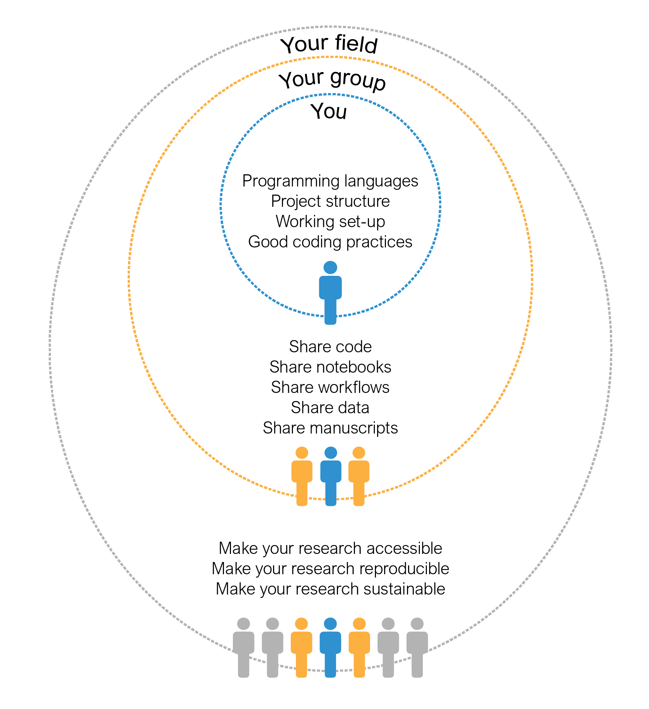

---
author-meta:
- "Benjam\xEDn J. S\xE1nchez"
- Daniela C. Soto
bibliography:
- content/manual-references.json
date-meta: '2021-02-15'
header-includes: "<!--\nManubot generated metadata rendered from header-includes-template.html.\nSuggest improvements at https://github.com/manubot/manubot/blob/master/manubot/process/header-includes-template.html\n-->\n<meta name=\"dc.format\" content=\"text/html\" />\n<meta name=\"dc.title\" content=\"Manuscript Title\" />\n<meta name=\"citation_title\" content=\"Manuscript Title\" />\n<meta property=\"og:title\" content=\"Manuscript Title\" />\n<meta property=\"twitter:title\" content=\"Manuscript Title\" />\n<meta name=\"dc.date\" content=\"2021-02-15\" />\n<meta name=\"citation_publication_date\" content=\"2021-02-15\" />\n<meta name=\"dc.language\" content=\"en-US\" />\n<meta name=\"citation_language\" content=\"en-US\" />\n<meta name=\"dc.relation.ispartof\" content=\"Manubot\" />\n<meta name=\"dc.publisher\" content=\"Manubot\" />\n<meta name=\"citation_journal_title\" content=\"Manubot\" />\n<meta name=\"citation_technical_report_institution\" content=\"Manubot\" />\n<meta name=\"citation_author\" content=\"Benjam\xEDn J. S\xE1nchez\" />\n<meta name=\"citation_author_institution\" content=\"Department of Bioengineering, Technical University of Denmark, Kgs. Lyngby, 2800, Denmark\" />\n<meta name=\"citation_author_orcid\" content=\"0000-0001-6093-4110\" />\n<meta name=\"twitter:creator\" content=\"@BenjaSanchez\" />\n<meta name=\"citation_author\" content=\"Daniela C. Soto\" />\n<meta name=\"citation_author_institution\" content=\"Genome Center, MIND Institute, and Department of Biochemistry &amp; Molecular Medicine, Davis, CA 95616,USA\" />\n<meta name=\"citation_author_orcid\" content=\"0000-0002-6292-655X\" />\n<link rel=\"canonical\" href=\"https://computer-aided-biotech.github.io/better-cb/\" />\n<meta property=\"og:url\" content=\"https://computer-aided-biotech.github.io/better-cb/\" />\n<meta property=\"twitter:url\" content=\"https://computer-aided-biotech.github.io/better-cb/\" />\n<meta name=\"citation_fulltext_html_url\" content=\"https://computer-aided-biotech.github.io/better-cb/\" />\n<meta name=\"citation_pdf_url\" content=\"https://computer-aided-biotech.github.io/better-cb/manuscript.pdf\" />\n<link rel=\"alternate\" type=\"application/pdf\" href=\"https://computer-aided-biotech.github.io/better-cb/manuscript.pdf\" />\n<link rel=\"alternate\" type=\"text/html\" href=\"https://computer-aided-biotech.github.io/better-cb/v/e695fc1062fa9c43b23e2dbd6fcfcff1c86183c6/\" />\n<meta name=\"manubot_html_url_versioned\" content=\"https://computer-aided-biotech.github.io/better-cb/v/e695fc1062fa9c43b23e2dbd6fcfcff1c86183c6/\" />\n<meta name=\"manubot_pdf_url_versioned\" content=\"https://computer-aided-biotech.github.io/better-cb/v/e695fc1062fa9c43b23e2dbd6fcfcff1c86183c6/manuscript.pdf\" />\n<meta property=\"og:type\" content=\"article\" />\n<meta property=\"twitter:card\" content=\"summary_large_image\" />\n<link rel=\"icon\" type=\"image/png\" sizes=\"192x192\" href=\"https://manubot.org/favicon-192x192.png\" />\n<link rel=\"mask-icon\" href=\"https://manubot.org/safari-pinned-tab.svg\" color=\"#ad1457\" />\n<meta name=\"theme-color\" content=\"#ad1457\" />\n<!-- end Manubot generated metadata -->"
keywords:
- markdown
- publishing
- manubot
lang: en-US
manubot-clear-requests-cache: false
manubot-output-bibliography: output/references.json
manubot-output-citekeys: output/citations.tsv
manubot-requests-cache-path: ci/cache/requests-cache
title: Manuscript Title
...

<small><em>
This manuscript
([permalink](https://computer-aided-biotech.github.io/better-cb/v/e695fc1062fa9c43b23e2dbd6fcfcff1c86183c6/))
was automatically generated
from [computer-aided-biotech/better-cb@e695fc1](https://github.com/computer-aided-biotech/better-cb/tree/e695fc1062fa9c43b23e2dbd6fcfcff1c86183c6)
on February 15, 2021.
</em></small>

## Authors

+ **Benjamín J. Sánchez** 
    {.inline_icon}
    [0000-0001-6093-4110](https://orcid.org/0000-0001-6093-4110)
    · {.inline_icon}
    [BenjaSanchez](https://github.com/BenjaSanchez)
    · {.inline_icon}
    [BenjaSanchez](https://twitter.com/BenjaSanchez) 
  <small>
     Department of Bioengineering, Technical University of Denmark, Kgs. Lyngby, 2800, Denmark
  </small>

+ **Daniela C. Soto** 
    {.inline_icon}
    [0000-0002-6292-655X](https://orcid.org/0000-0002-6292-655X)
    · {.inline_icon}
    [dcsoto](https://github.com/dcsoto) 
  <small>
     Genome Center, MIND Institute, and Department of Biochemistry & Molecular Medicine, Davis, CA 95616,USA
  </small>

## Abstract {.page_break_before}

This should be the abstract.

## Introduction

Since Margaret Dayhoff pioneered the field of bioinformatics back in the sixties, the application of computational tools to the field of biology has vastly grown in scope and impact. Nowadays, biotechnological and biomedical research are routinely fed by the insights arising from novel computational approaches, machine learning algorithms and mathematical models. The ever increasing amount of biological data and the exponential growth in computing power will amplify this trend in the years to come.

The use of computers to address biological matters encompasses a wide array of applications usually grouped under the terms of "computational biology" and "bioinformatics". Although distinct definitions have been delineated for each one [@url:https://www.kennedykrieger.org/sites/default/files/library/documents/research/center-labs-cores/bioinformatics/bioinformatics-def.pdf;@pmid:11552348], here we will consider both under the umbrella term “computational biology”, alluding to any application that involves the intersection of computing and biological data. As such, a computational biologist can be a data analyst, a data engineer, a statistician, a mathematical modeler, a software developer, and many others. In praxis, the modern computational biologist will be a “scientist of many hats”, taking on several of the duties listed above. But first and foremost, we will consider a computational biologist as a scientist whose ultimate goal is answering a biological question or addressing a need in the life sciences, by means of computation.

Scientific computing requires following specific practices to enable shareable, reproducible and sustainable outputs that stand the test of time. Computing-heavy disciplines such as software engineering and data science have already adopted practices addressing the need for collaboration, visualization, project management, and strengthening of online communities. However, as a highly interdisciplinary and evolving field, computational biology has yet to acquire a set of universal "best practices". As most computational biologists come from diverse backgrounds and oftentimes lack formal computational training, the absence of guidelines can lead to disparate and unsustainable practices that hinder reproducibility and collaboration, and slow down biomedical and biotechnological research.

Over the last decade, several researchers have published advice directed to bench scientists starting in either scientific computing [@doi:10.1371/journal.pcbi.1005510;doi:10.1371/journal.pbio.1001745;@doi:10.1093/gigascience/giz054] or computational biology [@doi:10.1038/nbt.2740]. The advice encompasses a wide range of topics ranging from programming to project organization to manuscript writing. Other works have adopted a different approach, fixating in one powerful tool and diving deeper into its scope and applications, such as the software development and version control cloud service GitHub [@doi:10.1371/journal.pcbi.1004947] and the web-application Jupyter Notebooks [@arxiv:1810.08055v1]. Similarly, recent works have chosen to comprehensively address one specific need in computational biology such as workflow automation [@doi:10.1101/2020.06.30.178673] and software library development [@doi:10.1016/j.cels.2017.08.003]. Although this advice proves immensely helpful, several aspects of the computational biology "journey" remain uncovered. Specifically, there is a lack of a clear roadmap regarding best practices from fundamental to advanced topics, in addition to practical examples tackling the complexities of this kind of research.

We premise that best practices in computational biology lie within a continuum that traverses three "levels": the individual’s internal practices, the collaborative practices of a team, and the practices that allow a broader scientific community to access and engage over time with the research (Figure {@fig:levels-fig}). Each one of these levels has a different set of needs and challenges. Here, we compile a selected list of relevant practices and related tools advisable for each one of these levels, emphasizing their time and place in a computational biology research project. Finally, we illustrate the utility of these practices in three case studies covering the broader spectrum of computational biology research.

{#fig:levels-fig width="75%"}

## Level 1: Personal Research

Goal: How should you manage your computational biology project?

Topics:
- Literate programming: R Markdown, Jupyter Notebooks
- Version control: Git / GitHub (commits)
- Software versioning and environment managers (Conda, python-env)
- Modularize, snippets
- Coding style: variable naming, linter, pep8, commenting
- Programming practices: paradigms (object-oriented, procedural), assertions, pair-programming

## Level 2: Collaboration

Goal: How to allow your collaborators to reproduce and interact with your research/software?

Topics:
- Sharing notebooks: R Markdowns and Jupyter Notebooks (Binder, Google CoLab)
- Sharing apps: Shiny apps, Dashboard.
- GitHub (branching, pull requests)
- Workflow automation: Snakemake (NextFlow, Make, Bash script)
- Sharing data and metadata

## Level 3: Community

Goal: How to develop and maintain a computational biology project with community feedback over time?

Topics:
- GitHub releases and semantic versioning
- Git Flow, GitHub Issues
- Continuous integration and unit tests
- Dependencies per user: pip-tools
- Sharing software as Python packages, Conda/Bioconda or containers (Docker, Singularity)
- Include license (MIT) and DOIs
- Documentation: read the docs.

## Case studies

- Example of computational biology project 1: RNA-seq analysis (workflow)
- Example of computational biology project 2: Genome-scale metabolic model (systems biology project)
- Example of computational biology project 3: Software development (computational tool)

## Conclusion

Pending

## Acknowledgments

Pending

## References {.page_break_before}

<!-- Explicitly insert bibliography here -->

